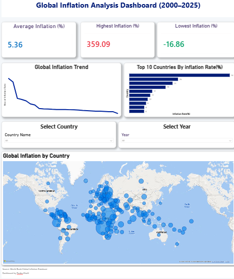

# Global Inflation Analysis: Macroeconomic Trends & Volatility Forecasting (2000–2025)

An independent econometric and data analytics project examining cross-country consumer price dynamics utilizing authoritative global development indicators.

---

## 📈 Executive Research Summary
This project analyzes the structural trajectory, volatility patterns, and transmission channels of global inflation across the last 25 years. By isolating macroeconomic trends across developing economies—with a specific comparative framework focusing on Pakistan, India, and China—this study leverages quantitative data modeling to evaluate historical price shocks and test the predictive capability of linear trend forecasting models.

### 🖼️ Interactive Analytics Layer
*(Double-check your repository to ensure your image path is correct, then replace the placeholder filename below with your exact dashboard image name to make it display automatically on your front page)*

---

## 🔬 Core Research Questions
1. **Structural Trajectory:** How did global consumer price inflation evolve across distinct geographic cohorts between 2000 and 2025?
2. **Volatility Metrics:** Which sovereign economies experienced the highest baseline inflation levels and structural price volatility?
3. **Regional Dynamics:** How do Pakistan's long-term inflation trend lines and systemic volatility metrics compare empirically with regional counterparts like India and China?
4. **Predictive Capability:** Can historical transactional price indexes serve as reliable baseline parameters for linear trend forecasting?

---

## 🛠️ Econometric Framework & Methodology
Rather than relying on basic statistical overviews, this project engineers an end-to-end quantitative pipeline to clean, balance, and evaluate multi-decade panel metrics:

* **Data Engineering & Structural Integrity:** Extracted structural parameters from the **World Bank Open Data database** using the Consumer Prices Indicator (`FP.CPI.TOTL.ZG`). Addressed missing cross-country records to enforce strict data density standards.
* **Exploratory Macroeconomic Modeling:** Executed localized sector stability checks, multi-variable correlation analysis, and price trend indexing using Python (`Pandas`, `NumPy`, `Statsmodels`).
* **Volatility Analysis:** Calculated historical distribution metrics and price deviations to isolate systemic vulnerabilities across emerging market frameworks.
* **Trend Forecasting:** Implemented Ordinary Least Squares (OLS) linear trend estimation layers via `Scikit-learn` to map structural trend trajectories.
* **Visual Intelligence Architecture:** Processed the finalized data blocks into a customized relational schema, deploying a dynamic, multi-page canvas layer in **Power BI** for real-time trend discovery.

---

## 📂 Core Project Architecture
* **`analysis_final.py`** — Primary Python engine managing automated data aggregation, structural cleaning, exploratory analysis, and econometric trend modeling.
* **`Cleaned_Global_Inflation_Data.csv`** — The verified, balanced cross-country macroeconomic dataset.
* **`Dashboard.pbix`** — The compiled Power BI architecture containing structural canvas layers and interactive trend visualizers.
* **`Graphs/`** — Dedicated asset directory containing localized matplotlib distribution maps and regression outputs.

---

## 👩‍🔬 Author
**Tooba Khalil**  
BS Economics Candidate  
Government College University (GCU), Lahore, Pakistan  

*Independent Data Portfolio Project | Focus Area: Quantitative Macroeconomics and Financial Intelligence*

## Project Files

### Python Analysis

[analysis final.py](./analysis%20final.py)

Main Python script containing the data cleaning, analysis, visualization, statistical analysis, and Linear Regression forecasting.

### Cleaned Dataset

[Cleaned_Global_Inflation_Data.csv](./Cleaned_Global_Inflation_Data.csv)

Cleaned World Bank inflation dataset used for the analysis.

### Analysis Graphs

[Graphs](./Graphs/)

Contains the visualizations generated during the Python analysis.

### Power BI Dashboard

[Dashboard.pbix](./Dashboard.pbix)

Interactive Power BI dashboard developed for the project.

[Dashboard Preview](./Dashboard%20p4.png)

Preview image of the completed Power BI dashboard.

### Research Report

[Final Research Report](./Global%20Inflation%20Analysis.docx%20research.pdf)

Complete research report documenting the methodology, analysis, findings, forecasting, and conclusions.

